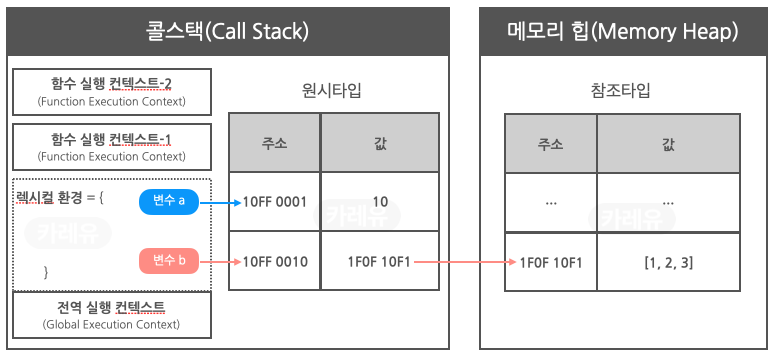

이 정도는 알아야 비동기의 예상치 못한 동작에 울지 않고 프로그래밍할 수 있게 된다.

* toc
{:toc}

# 싱글 스레드 언어인 JavaScript에서 비동기 프로그래밍이 가능한 이유

## 동기 vs 비동기 ?

동기(Synchronous)와 비동기(Asynchronous)는 프로그램에서 작업이 <u>어떻게 실행되고 관리되는지</u>를 설명하는 개념이다.

동기적인 작업은 순차적으로 진행되며, 한 작업이 끝나야 다음 작업이 시작된다. 즉, 작업 A가 시작하면 작업 A가 완료되기 전에는 작업 B를 시작하지 않는다. 이로 인해 코드의 실행 흐름이 예측 가능하고, 디버깅이 상대적으로 쉽다.

```jsx
console.log("첫 번째 작업 시작");
// 작업 A
console.log("첫 번째 작업 끝");

console.log("두 번째 작업 시작");
// 작업 B
console.log("두 번째 작업 끝");
```

비동기적인 작업은 작업이 병렬로 진행되거나 다른 작업이 끝나기를 기다리지 않고 진행되는 것을 말한다. 작업 A와 작업 B가 동시에 실행되거나, 작업 B가 작업 A가 완료되기 이전에 시작되는 것이다.

```jsx
console.log("첫 번째 작업 시작");
// 비동기 작업 A (예: 파일 읽기)
console.log("첫 번째 작업 진행 중");

console.log("두 번째 작업 시작");
// 비동기 작업 B (예: 네트워크 요청)
console.log("두 번째 작업 진행 중");
```

## 싱글 스레드?

싱글 스레드는 컴퓨터 프로그램이 동시에 실행되는 하나의 실행 스레드<sup>*</sup>(thread)만을 가지는 환경을 가리킨다. 즉, 한 번에 하나의 작업만을 처리할 수 있는 환경이다.  
<sub>*여기에서 "스레드(thread)"란 하나의 프로그램 내에서 실행되는 독립적인 작업 흐름을 말한다.</sub>

싱글 스레드 환경에서는 다음과 같은 특징이 있다:
* 순차적 실행: 모든 작업이 순차적으로 실행된다. 즉, 한 작업이 시작하면 이 작업이 완료될 때까지 다른 작업이 시작되지 않는다.
* 블로킹: 만약 한 작업이 시간이 오래 걸리거나 무한히 기다리는 경우, 프로그램 전체가 블록될 수 있다. 다른 작업은 기다리고 있어야 한다.
* 응답성: 싱글 스레드 환경에서는 응용 프로그램이 사용자 입력에 빠르게 응답하기 어렵다. 긴 작업이 진행 중이면 응용 프로그램이 응답하지 않는 것처럼 느껴질 수 있다.
* 단순성: 멀티 스레드나 멀티 프로세스 환경보다 코드가 단순하고 예측 가능할 수 있다.

그런데 싱글 스레드 언어라는 JavaScript는 위 특징과는 다르게 동작한다.  
이게 어떻게 가능한 일일까? 정답은 Event Loop에 있다.  

## Event Loop

우리가 JavaScript를 보고 싱글 스레드 언어라고 할 때, 이때의 JavaScript는 엔진<sup>*</sup> 그 자체를 의미한다.  
<sub>*자바스크립트 엔진은 자바스크립트 코드를 실행하는 프로그램 또는 인터프리터이다. Chrome/Node.js에서 사용되는 V8, FireFox에서 사용되는 SpiderMonkey, Edge에서 사용되는 Chakra, Safari/React Native에서 사용되는 Javascript Core 등이 JS 엔진이다.
</sub>  

한 번에 하나의 작업만 처리하며 코드가 블록되는 것을 피하기 위해 비동기 프로그래밍 패턴이 중요하다.  
이를 위해 자바스크립트 엔진은 주로 브라우저, Node.js와 같은 런타임 환경과 함께 사용되며 이러한 환경을 통해 여러 스레드를 사용하여 작업을 처리할 수 있게 된다.  

이러한 런타임 환경이 기반하고 있는 것이 [이벤트 루프](https://developer.mozilla.org/ko/docs/Web/JavaScript/Event_loop)이다.  


### JS 엔진의 주요 구성 요소: 메모리 힙, 콜 스택
위 이미지의 좌측 박스에 해당하는 JS 엔진의 주요 구성 요소로는 메모리 힙과 콜 스택이 있는데,   
메모리 힙에는 참조 타입(객체, 배열, 함수 등)이 콜스택에는 원시 타입(정수, 문자, 논리 리터럴 등)이 저장된다. 



`var b = [1,2,3]` 를 통해 변수 b에 배열 [1,2,3]을 할당했을 때 배열 자체는 메모리 힙에 저장되고  
b에 대한 주소는 콜 스택에 저장된다. b의 값은 배열을 향한 주소를 갖게 된다.  
어떻게 동작하는지 차례대로 살펴보면    

>1. 코드가 실행되면 선언되어 있는 변수나 함수 등이 현재 실행 컨텍스트의 <u>렉시컬 환경</u>에 추가된다. 현재 변수 b만 있는 코드라면, 새로운 변수 **b**가 초기화되지 않은 상태로 추가된다. <sub>cf. 함수의 경우 초기화 된 상태로 추가됨.</sub>
>- 이 '실행'은 콜 스택을 통해 관리된다. 콜 스택은 현재 실행 중인 **함수**와 그 함수 내에서 **호출된 함수의 스택**을 관리한다.
>  - 콜 스택 위에서 관리되는 것 중 **실행 컨텍스트(Execution Context)**가 있는데, 이는 코드 실행에 필요한 정보를 담고 있는 객체이다. 
>  - 이 실행 컨텍스트 내에는 **렉시컬 환경**(어휘적 환경)이라고 불리는 객체가 있다. 렉시컬 환경은 변수와 함수의 식별자를 값과 매핑하는 역할을 한다.
>2. `var b = [1,2,3]` 코드 실행이 시작되면 <u>[1, 2, 3] 배열 리터럴은 메모리 힙</u>에 할당되고, 이 **배열의 메모리를 참조하는 주소가 변수 b에** 저장된다.
>3. 코드 실행이 종료되면 콜 스택에서 현재 실행 컨텍스트가 팝(pop)되고 제거된다.
>
> \+ 렉시컬 환경에 대해 좀 더 자세히 알고 싶다면 [자바스크립트 중급 강좌 #11 클로저(Closure) 5분만에 이해하기](https://youtu.be/tpl2oXQkGZs?si=jEUw9KGIDiDcBBl9) 참고


### JS 런타임 환경
위와 같은 JS 엔진에 Web API, Callback Queue, Event Loop 등이 함께 쓰이며 JavaScript가 구동되고 이를 런타임 환경이라고 부른다.  

```jsx
$.on('button', 'click', function onClick() {
    setTimeout(function timer() {
        console.log('You clicked the button!');    
    }, 1000);
});

console.log("Hi!");

setTimeout(function timeout() {
    console.log("Click the button!");
}, 5000);

console.log("Welcome to loupe.");
```
이러한 코드가 실행될 때 JavaScript 런타임 환경의 작동 과정을 살펴보면,
1. 코드 블럭 하나하나가 콜 스택에 들어갔다가 실행이 종료되면 나온다.
2. Web APIs에는 `$.on('button', 'click', ...)`와 같은 이벤트 등록, `timer()`와 `timeout()`같은 setTimeout의 콜백함수가 들어간다.
   * $.on은 jQuery지만 내부에서 Web APIs에 해당하는 DOM API를 사용하고 있다.
     * DOM API는 `document.getElementById()`, `element.innerHTML`와 같은 것을 말한다.
   * 이외에도 `addEventListener()`와 같은 이벤트 API, fetch, canvas, localStorage.setItem(), worker 등이 Web APIs에 해당된다.
3. `timer()`, `timeout()`은 명시된 시간이 지나면 콜백큐로 이동한 후 콜스택이 비어있으면 스택으로 이 후 실행된다.
   * 이때 <u>콜스택이 비어있으면</u>을 확인하는 것이 이벤트 루프이다.  

위 코드의 흐름을 시각화해서 보고 싶다면 [Philip Robert’s tool](http://latentflip.com/loupe/?code=JC5vbignYnV0dG9uJywgJ2NsaWNrJywgZnVuY3Rpb24gb25DbGljaygpIHsKICAgIHNldFRpbWVvdXQoZnVuY3Rpb24gdGltZXIoKSB7CiAgICAgICAgY29uc29sZS5sb2coJ1lvdSBjbGlja2VkIHRoZSBidXR0b24hJyk7ICAgIAogICAgfSwgMjAwMCk7Cn0pOwoKY29uc29sZS5sb2coIkhpISIpOwoKc2V0VGltZW91dChmdW5jdGlvbiB0aW1lb3V0KCkgewogICAgY29uc29sZS5sb2coIkNsaWNrIHRoZSBidXR0b24hIik7Cn0sIDUwMDApOwoKY29uc29sZS5sb2coIldlbGNvbWUgdG8gbG91cGUuIik7!!!PGJ1dHRvbj5DbGljayBtZSE8L2J1dHRvbj4%3D)을 활용해보자.

이러한 런타임 환경으로 인해 JavaScript는 블로킹 연산을 하지 않을 수 있게 된다.   
어떤 요청의 응답을 기다리는 중에도 다른 사용자의 입력을 처리할 수 있게 되는 것이다.

# JavaScript에서 비동기 프로그래밍 하는 방법
## Callback Functions, Promises, Async, Await
초기 자바스크립트에서는 주로 **콜백 함수(Callback Functions)**를 사용하여 비동기 작업을 다루었다.   
예를 들어, 타이머 함수 setTimeout과 XMLHttpRequest를 사용할 때 콜백 함수를 등록하여 비동기적인 동작을 처리하는 것이다.  
이러한 콜백 함수만으로는 연쇄적인 동작을 처리할 때 콜백 지옥(Callback Hell)을 만나야했기 때문에 **프로미스(Promises)**가 등장한다.  
Promises는 ECMAScript 6(ES6)에서 도입된 것으로, 말그대로 약속을 의미한다. 지금은 뭔지 모르겠는데, 나중엔 알려줄게. 라는 약속.   
이 나중에(비동기적으로) 실행되는 작업의 <u>결과를 나타내는 객체</u>가 프로미스이다.
```javascript
fs.readFile('file1.txt', 'utf8', function(err, data) {
  if (err) {
    console.error(err);
  } else {
    fs.readFile('file2.txt', 'utf8', function(err, data) {
      if (err) {
        console.error(err);
      } else {
        fs.readFile('file3.txt', 'utf8', function(err, data) {
          if (err) {
            console.error(err);
          } else {
            console.log(data);
          }
        });
      }
    });
  }
});
```
이랬던 코드를 프로미스를 사용하면
```javascript
const readFile = (fileName) => {
  return new Promise((resolve, reject) => {
    fs.readFile(fileName, 'utf8', (err, data) => {
      if (err) {
        reject(err);
      } else {
        resolve(data);
      }
    });
  });
};

readFile('file1.txt')
  .then(data => {
    console.log(data);
    return readFile('file2.txt');
  })
  .then(data => {
    console.log(data);
    return readFile('file3.txt');
  })
  .then(data => {
    console.log(data);
  })
  .catch(err => {
    console.error(err);
  });
```
이렇게 깔끔하게 사용할 수 있다.

자 여기서 ECMAScript 2017(ES8)에서 도입된 **Async, Await**을 사용하면 좀 더 깔끔해진다.
```javascript
const readFile = async (fileName) => {
  try {
    const data = await fs.promises.readFile(fileName, 'utf8');
    return data; // Promise에서 resolve(data)였던 부분
  } catch (err) {
    throw err; // Promise에서 reject(err)였던 부분
  }
};

const main = async () => {
  try {
    const data1 = await readFile('file1.txt');
    console.log(data1);
    
    const data2 = await readFile('file2.txt');
    console.log(data2);
    
    const data3 = await readFile('file3.txt');
    console.log(data3);
  } catch (err) {
    console.error(err);
  }
};

main();
```
then으로 계속 연결하는 것이 아니라, await 키워드를 사용하여 해당 작업이 끝나기 전까지 기다리게 할 수 있는 것이다.  

## 꼭 알아야할 것?
비동기 프로그래밍을 할 때 이정도는 알고 넘어가야 한다 싶은 것들을 적어봤다.  
* 함수를 호출하며 다른 함수를 인자로 전달할 때, 이 다른 함수가 콜백함수이다.
  * setTimeOut의 첫번째로 전달하는 함수도 콜백 함수이다.
    * setTimeOut, setInterval는 '호출 스케줄링'에 사용하는 함수로 작업을 예약하는 일이 전부이기 때문에 실행 직후 종료된다.
* 동기는 동시에 여러 작업을 수행할 수 없지만, 비동기는 가능하다.
  * 비동기로 하면 좋은 작업들: 요청을 보낸 다음 응답이 올때까지 기다릴 때, 데이터를 가져올때, 파일을 읽고 쓸 때
* New promise((resolve, reject) => {} 를 executor라고 하는데, 이 executor 내부에서 throw 하면 catch로 연결된다.
  * Executor의 return값은 무시된다.
  * 첫번째 reject/resolve/throw만 유효하다.
* **Async함수의 리턴값은 형태가 어떻든, 무조건 Promise**이다.
  * Async 함수(theAsyncFunc) 내에서 return "Hi" 하더라도 const promise1 = theAsyncFunc(); 하면 promise1은 Promise이다. await 키워드를 사용해야 return(resolve)한 값을 사용할 수 있는 것이다.
*	모든 비동기 동작을 Async 함수로 만들 수 있는 건 아니다. resolve(value)를 return value로 못 바꿀 때, 예를 들어 resolve를 비동기 동작 내 다른 함수 호출을 통해 할 때 Async로 변환할 수 없다.
* Await은 await {Promise 객체}로 사용한다. 
  * await은 Promise가 완료될 때까지 기다린다. == 다음 코드를 실행하지 않는다.
  * async에서 await을 안쓰고 promise객체만 나열하면 끝날때까지 기다리지 않고 바로 종료된다.
* Finally는 이행/거부와 상관없이 가장 마지막으로 실행된다.


***
<h4>참고 문헌</h4>

- [The event loop](https://developer.mozilla.org/en-US/docs/Web/JavaScript/Event_loop)
- [[자바스크립트] 콜스택/메모리힙 구조, 데이터 저장/참조 원리](https://curryyou.tistory.com/276)
- [JavaScript engine & 작동 원리](https://velog.io/@kirin/%EC%9E%90%EB%B0%94%EC%8A%A4%ED%81%AC%EB%A6%BD%ED%8A%B8-%EC%97%94%EC%A7%84JavaScript-engine)
- [[js]js는 싱글스레드언어인데 어떻게 병렬처리가 가능한걸까???](https://coding-lks.tistory.com/174)
- [자바스크립트 엔진, Event Loop, Web API, Task Queue](https://velog.io/@ksh4820/Event-Loop)
- [The JavaScript Engine and Runtime Environment](https://medium.com/@lizfaria/the-javascript-engine-and-runtime-environment-e0ed86fea903)
- [[Javascript] 비동기, Promise, async, await 확실하게 이해하기](https://springfall.cc/article/2022-11/easy-promise-async-await)