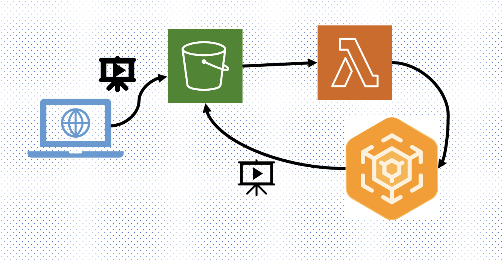

동영상을 재생했을 때 로딩 속도에 개선이 필요하다는 이야기가 들려왔다.   
이를 개선하기 위해 원인을 분석하고, 조치를 취한 과정을 기록했다.  
화질을 최대한 보존하며 파일 크기를 최대한 줄이는 최적화를 통해, 저장 비용과 속도 측면에서 87%의 개선을 가져올 수 있었다.

* toc
{:toc}

# 1. 원인 분석
원인 분석을 위해서 현 상황을 제대로 파악해야 했다.  
48초 짜리 동영상을 플랫폼에서 재생시켜 보았더니, 로딩 시간을 포함해 영상을 모두 시청할 때까지 2분 30초 정도 소요되었다.  
1분도 안 되는 동영상을 보려는데 영상이 끊기며 재생된다니,, 다 보려면 원래 영상 길이 3배 가량의 시간이 걸린다니,, 이건 문제가 맞았다.  

Network 탭을 켜서 영상과 관련된 요청을 확인해봤더니, 영상 하나에 여러 개의 206 requests가 있었다.  
서버에서 별다른 Range header를 설정하지 않았는데도, 크롬 브라우저에서 Range 요청을 자동으로 생성한 것 같았다.  
작게 나누어 받고 있는데도 이 로딩 속도가 플레이 속도를 따라잡지 못한다는 건 네트워크 대역폭 문제는 아닐 거라 판단했다.  

그렇다면 서버 성능이나 동영상 파일 크기 자체를 의심해볼 수 있었다.  

## 서버 성능 체크 (Feat. Elastic Beanstalk)
우선 Elastic Beanstalk의 모니터링 지표를 살펴보았다.  
환경 상태 정상이었고, 요청 수로 본 트래픽 레벨도 낮았으며, CPU 이용률이나 네트워크 데이터 송수신량도 낮았다.  
혹시 몰라 살펴본 로그에서 응답시간 분포도 나쁘지 않았고, 해당 요청에 대한 응답시간도 2초 미만이었다.  
> 🧐 <b>Elastic Beanstalk에서 로그 확인 하는 법</b>  
> 로그를 다운 받아 Eb-engine.log, access.log, error.log 등을 살펴보면 된다.  
> > 000.00.00.00 - - [24/May/2023:09:33:34 +0000] "POST /url/to/data HTTP/1.1" 200 <u>1887</u> "https://example.com/" "Mozilla/5.0 (Macintosh; Intel Mac OS X 10_15_7) AppleWebKit/537.36 (KHTML, like Gecko) Chrome/113.0.0.0 Safari/537.36" "000.000.000.000, 000.000.00.000, 00.000.0.00"  
> 
> 위와 같은 로그가 있을 때, 1887에 해당하는 부분이 응답시간을 나타낸다.  

## 인코딩 & 압축 테스트
지금까지는 사용자가 동영상을 업로드하면 별도의 인코딩이나 압축없이 원본 동영상을 사용해왔다.  
이게 문제였던 것 같아서 테스트 동영상을 다양한 방법으로 압축해봤다.  

차후 AWS의 MediaConvert를 사용해 압축할 거라 코덱은 Pro가 아닌 H.264로 설정하고,  
주로 파일 크기에 직접적인 영향을 미치는 **비트레이트**<sup>*</sup> 조작을 통해 화질과 파일 크기의 적당한 밸런스를 찾았다.  
<sub>*비트레이트(Bitrate): 비디오나 오디오 스트림에서 초당 전송되는 비트 수를 나타내는 측정 단위</sub>  
<sub>cf. 사용자의 네트워크 연결 상태에 따라 비디오 품질을 자동으로 조절하는 기술을 ABR(Adaptive <b>Bitrate</b> Streaming)이라고 한다.</sub>  
<br>
여러 시도를 해 본 결과 최적의 설정은 비디오의 복잡성에 따라 동적으로 비트레이트를 조절<sup>*</sup>하는 **VBR(Variable Bitrate)**을 적용해 비트레이트와 최대 비트레이트를 적절히 정하는 것이었다.    
<sub>* 화면의 움직임이나 디테일이 많은 부분에서 높은 비트레이트를 사용하여 화질을 유지한다는 뜻</sub>  
<br>
해당 설정으로 인코딩을 진행했더니 원래 108MB였던 영상이 14MB로 압축되었고,   
플랫폼에서 재생해 본 결과 2분 30초가 걸렸던 기존과는 달리 <u>23초만에</u> 동영상이 전부 로딩되는 걸 볼 수 있었다.  


위가 압축 전, 아래가 압축 후다.  
87%의 압축률에도 유의미한 화질 차이 없이 인코딩할 수 있었다.
{:.figcaption}

# 2. 해결 방안 적용하기
## 기존 동영상 변환하기
앞으로 업로드될 동영상들에는 Lambda로 MediaConvert Job을 생성해서 자동화시킬 예정이었으나, 기존 영상들의 변환이 필요했다.  

하나하나 다운로드 받아서 압축 돌리기는 너무 번거롭기 때문에 파이썬으로 S3에서 파일을 다운로드 받고, 압축시킨 뒤, S3에 업로드하는 코드를 하나 짰다. <sub>파이썬인 이유는,, 내가 편해서,,</sub>  

아래와 같은 코드를 작동시키기 위해서는 `Python`과 Python의 AWS SDK인 `Boto3`, `AWS CLI` 그리고 `ffmpeg`이 필요하다.  
ffmpeg 그냥 웹사이트 들어가서 설치했더니 자꾸 Not found랑 Permission error가 떠서 나는 brew를 이용해 설치했다.  


```python
import boto3
import subprocess
import os

bucket_name = 'example-bucket'
ffmpeg_path = '/opt/homebrew/bin/ffmpeg'
s3_client = boto3.client('s3')
response = s3_client.list_objects_v2(Bucket=bucket_name)

for obj in response['Contents']:
    key = obj['Key']
    compressed_key = key.replace("some-value", "some-value-2")
    input_url = f's3://{bucket_name}/{key}'
    output_url = f's3://{bucket_name}/{compressed_key}'

    local_directory = '/Users/mymac/Downloads/somewhere'
    os.makedirs(local_directory, exist_ok=True)
    
    local_input_path = os.path.join(local_directory, key.split('/')[-1])  
    s3_client.download_file(bucket_name, key, local_input_path)

    local_output_path = os.path.join(
        local_directory, compressed_key.split('/')[-1])
    subprocess.run([ffmpeg_path, '-i', local_input_path, '-b:v', '{some-value-1}',
                    '-maxrate', '{some-value-2}', '-bufsize', '{some-value-3}', '-c:v', 'libx264',
                    local_output_path], check=True)
    # bufsize는 비디오 압축 중에 사용되는 버퍼 크기를 나타내며, 비디오 인코딩 중에 일시적으로 발생할 수 있는 데이터 변동을 조절하는 데 사용됨. 보통 bufsize는 maxrate의 약 2배로 설정하는 것이 일반적. 
    s3_client.upload_file(local_output_path, bucket_name, compressed_key)

    # os.remove(local_input_path) # 원본 파일 백업을 다른 곳에 한다면 같이 지워도 된다.
    os.remove(local_output_path)

    print(f'Compressed {key} to {compressed_key}')
```

## Lambda & MediaConvert로 업로드 후 인코딩 자동화하기
MediaConvert 안 쓰고 Lambda에서 그냥 ffmpeg 레이어 써서 압축할 수도 있지만   
그러려면 S3에서 파일을 다운로드하고, 업로드하는 과정이 필요하기 때문에 속도를 고려해 MediaConvert를 사용하기로 했다.  


workflow나 diagram 전문으로다가 텍스트 기반으로 만들어주는 AI 필요한 거 나만 그렇습니까..
{:.figcaption}

동영상이 S3 버킷에 업로드 되면 Lambda 함수를 작동시켜 적절한 MediaConvert job을 생성하게 했다.  
MediaConvert job이 완료되고 압축 & 인코딩 된 동영상은 다시 S3 버킷에 업로드된다.  
> <sub>❗️ 원래 재귀호출(Recursive Invocation)을 방지하기 위해 Lambda의 Input, Output S3 bucket은 달라야 한다.   
> 나의 경우 다른 설정이 있어 동일 버킷으로 보내고 있다.</sub>  

job을 생성할 때 job.json과 같이 json 파일을 하나두고 거기서 작업 설정을 로드하게 하면 되는데, 예시는 [여기](https://docs.aws.amazon.com/ko_kr/mediaconvert/latest/ug/example-job-settings.html)서 볼 수 있다.  
<br>
이렇게 세팅을 마치면, 우리도 이제 자체 압축 & 인코딩 프로세스를 갖춘 채로, 끊김 없는 재생을 제공할 수 있게 된다.  
마무리는 ✨<u>Dramatic Effect</u>✨라고 칭찬받은 메세지로다가..!!  
<br>
